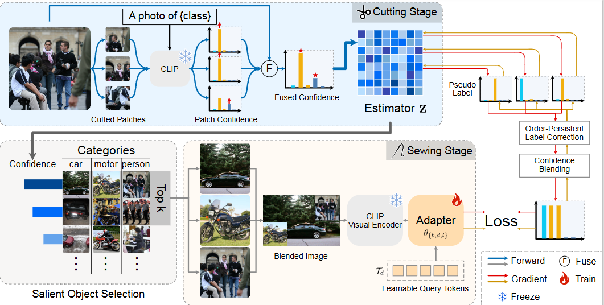

# TailorCLIP
Code implement of paper "Adapting Vision-Language Models from Iconic to Inclusive for Multi-Label Recognition Without Labels"

## 1. Method Overview

Understanding multi-label images remains a challenging task in computer vision. Although vision-language models (VLMs) enable zero-shot recognition without labeled data, they often focus on the most iconic object and miss contextual positives. This bias conflicts with the nature of multi-label learning.

We propose an unsupervised framework that adapts VLMs from iconic recognition to inclusive understanding for label-free multi-label image recognition.

Our method contains two key stages:

- Cutting stage: a multi-sampling response estimator is designed to prevent the model from concentrating on only one dominant object and to expose more positive labels.
- Sewing stage: a multi-object blend adaptation strategy is introduced to refine label distribution toward multi-label consistency while preserving the intrinsic characteristics of the original model. The adaptation is completed within one epoch.

Extensive experiments show that the framework significantly outperforms existing unsupervised methods on four public datasets, and even surpasses several representative weakly supervised baselines.

### Backbone Network




## 2. Installation

The codebase is Python/PyTorch based.

```bash
conda create -n tailorclip python=3.10 -y
conda activate tailorclip
pip install -r requirements.txt
```

If your environment cannot import randaugment:

```bash
pip install randaugment
# or
pip install git+https://github.com/ildoonet/pytorch-randaugment.git
```

## 3. Code

Main experiment entry:

- recipe_interpolation.py

Core modules:

- data.py
- losses.py
- label_names.py
- utils.py
- models/
- clip/
- clip_nopooling/
- chinopie/

## 4. Data

This release only keeps the main experiment code.
Large datasets, checkpoints, logs, and runtime artifacts are not included.

Expected dataset layout:

- deps/data/voc2012
- deps/data/voc2007
- deps/data/coco2014
- deps/data/NUS-WIDE

Set dataset name via environment variable:

```bash
export dataset=voc2012
```

## 5. Train

Run the main pipeline:

```bash
python recipe_interpolation.py \
  --comment interpolation-main \
  --version 1.9.2 \
  --num_epoch 30 \
  --dev cuda
```

## 6. Train/Validation Scripts

We provide convenient scripts in `scripts/`.

Training:

```bash
dataset=voc2012 ./scripts/train.sh
```

Validation:

```bash
dataset=voc2012 ./scripts/val.sh
```

Optional environment variables:

- COMMENT (default: interpolation-main)
- VERSION (default: 1.9.2)
- EPOCHS (default: 30, train script only)
- DEV (default: cuda)

Notes:

- Use the same COMMENT, VERSION, and dataset for training and validation.
- Validation loads the best checkpoint from the stage-2 run.

## 7. Outputs

During training, outputs are written to:

- deps/checkpoints/
- deps/boards/
- deps/state/
- opts/

## Citation

(To be added)

## Acknowledgment

This release is built on the local CLIP implementation and the lightweight chinopie training framework.
